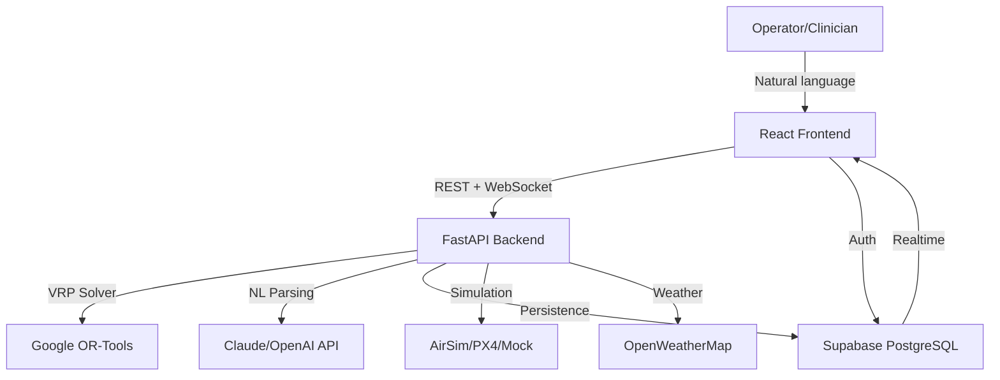
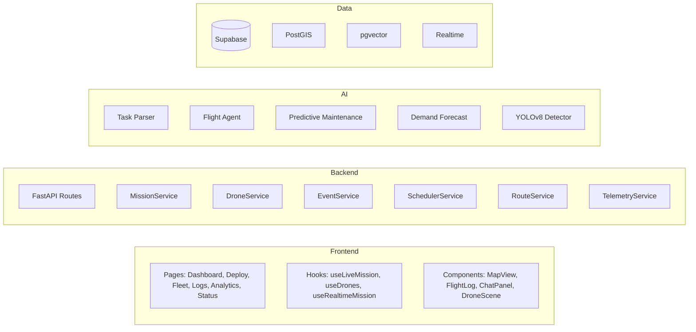
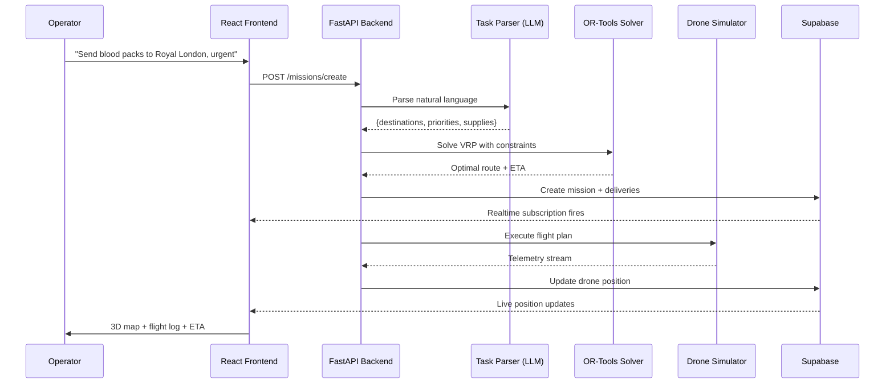
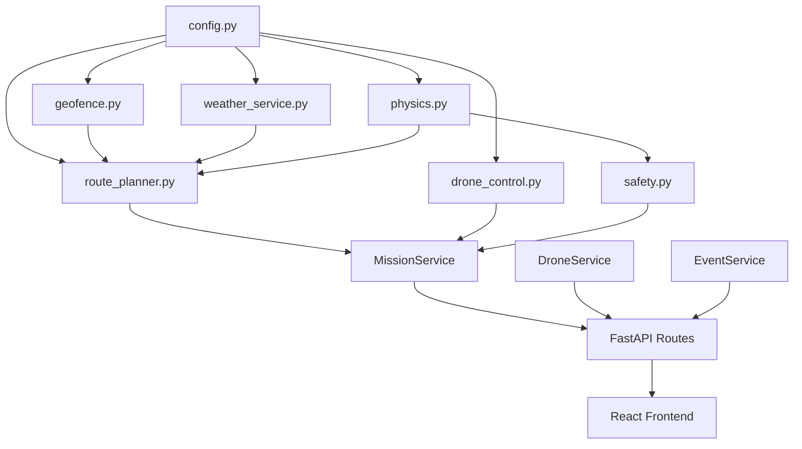

# DroneMedic Architecture

## System Overview

DroneMedic is a full-stack medical drone delivery platform that combines AI-powered natural language task parsing, aerospace-grade physics simulation, VRP route optimization, and real-time 3D visualization. The system is designed for autonomous medical supply delivery in urban environments with dynamic obstacle avoidance, no-fly zone enforcement, and weather-adaptive re-routing.

## C4 Context Diagram



## Service Architecture



## Data Flow



## Module Dependency Graph



## Tech Stack

| Layer | Technology |
|-------|-----------|
| Frontend | React 19, TypeScript, Vite 8, Tailwind v4, Three.js, Deck.gl |
| Backend | Python 3.9+, FastAPI, Google OR-Tools, MAVSDK |
| AI/ML | Claude API, OpenAI SDK, PyTorch, YOLOv8, LSTM Autoencoder |
| Physics | Custom aerospace engine (actuator disk theory, energy budgets) |
| Database | Supabase PostgreSQL + PostGIS + pgvector |
| Realtime | WebSocket + Supabase Realtime |
| Simulation | AirSim, PX4 SITL, Mock mode |
| Infrastructure | Docker, GitHub Actions CI/CD |

## Key Design Decisions

1. **Deterministic routing over AI**: OR-Tools handles all route optimization. The LLM is used only for natural language parsing -- never for route decisions.

2. **Physics-first feasibility**: Every mission passes through an aerospace physics engine (actuator disk theory, energy budgets, thrust-to-weight checks) before launch.

3. **Mock everything**: Weather, obstacles, AirSim, and PX4 all have mock mode fallbacks. The system runs fully offline for development and demos.

4. **Strict module separation**: Parsing, routing, simulation, and UI are independent layers connected through `config.py`. No cross-layer imports.

5. **Backward compatible**: All new function parameters have defaults. Existing calls never break.

## Supabase Features Used (20)

Auth, Database (9 tables), RLS, Realtime, PostGIS, pgvector, pg_cron, pg_trgm, pg_net, Vault, Storage (3 buckets), Edge Functions (4), DB Triggers, RPC Functions (8), Analytics Views (7), TypeScript Types, Python Client, React Hooks, GraphQL (pg_graphql), User Profiles

## Directory Structure

```
DroneMedic/
  ai/                    Task parser (LLM NL -> JSON)
  backend/
    domain/              Pydantic models + enums
    services/            MissionService, DroneService, EventService
    db/                  Supabase client + migrations
    geofence.py          No-fly zone ray-casting
    route_planner.py     OR-Tools VRP solver
    weather_service.py   OpenWeatherMap + mock
    physics.py           Aerospace energy/thrust model
    safety.py            Preflight checks
    metrics.py           Post-flight evaluation
  simulation/
    drone_control.py     AirSim/PX4/Mock drone controller
    obstacle_detector.py Simulated obstacle detection
    unity/               Unity 3D simulation project
  web/
    src/
      pages/             Dashboard, Deploy, Fleet, Logs, Analytics, Status
      components/        MapView, ChatPanel, DroneScene, FlightLog
      hooks/             useLiveMission, useDrones, useRealtimeMission
      lib/               Supabase client, API helpers
  frontend/
    dashboard.py         Streamlit legacy dashboard
  tests/                 pytest smoke tests
  config.py              Central configuration
  main.py                CLI orchestrator
```
